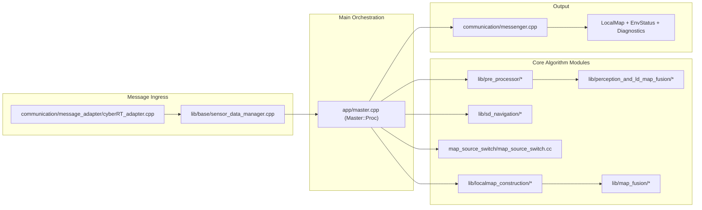
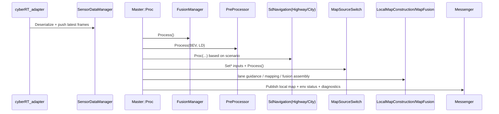

# ARCHITECTURE.md

## Purpose
This document describes the system-level architecture of the `env` module.
It complements `docs/FILE_MAP.md`:
- `ARCHITECTURE.md`: runtime flow, data flow, module interaction, change impact.
- `FILE_MAP.md`: file-level index and one-line responsibilities.

## Scope
Current product requirement is highway-focused NOA.

Default engineering focus:
- Highway navigation recommendation path
- Highway map source switch path

Legacy compatibility path:
- City navigation path remains in codebase but is not default change target.

## Runtime Inputs and Outputs
Inputs:
- BEV static perception (`lib/message/sensor/camera/bev_lane/bev_lane.h`)
- Routing/map data (`lib/message/env_model/routing_map/routing_map.h`)
- Map event data (`lib/message/env_model/routing_map/map_event.h`)
- Vehicle/sensor/planning related topics through message adapter

Outputs:
- Local map and env status outputs for downstream planning/control
- Navigation-related lane-level recommendation fields
- Diagnostics and debug info

## Architecture Diagram (Mermaid)

## Master::Proc Sequence (Mermaid)

## End-to-End Runtime Flow
1. Message ingress
- `communication/message_adapter/cyberRT_adapter.cpp`
- Deserialize middleware topics into internal structures and feed data manager.

2. Main orchestration
- `app/master.cpp` -> `Master::Proc`
- Drives each algorithm stage in sequence.

3. Preprocessing stage
- `lib/pre_processor/pre_processor.cpp`
- `lib/pre_processor/bev_map/bev_map_pre_processor.cpp`
- `lib/pre_processor/routing_map/routing_map_pre_processor.cpp`

4. Perception-LD fusion stage
- `lib/perception_and_ld_map_fusion/fusion_manager.cc`
- Data preprocessors:
  - `data_preprocessor/bev_map_preprocessor.cc`
  - `data_preprocessor/ld_map_preprocessor.cc`
  - `data_preprocessor/build_lane_topology.cc`
- Match/fusion core:
  - `data_fusion/match_maker.cc`
  - `data_fusion/multi_source_data_mixer.cc`
  - `data_fusion/geometry_match_info.cc`

5. Navigation recommendation stage
- `lib/sd_navigation/`
- Branch selection is scenario-dependent (highway/city).
- Highway implementation core:
  - `SdNavigationHighway.cpp`
- City implementation (legacy compatibility path):
  - `SdNavigationCity.cpp`

6. Map source switch stage
- `lib/perception_and_ld_map_fusion/map_source_switch/map_source_switch.cc`
- Decides perception map vs HD map usage based on scenario, matching, map quality/event status, and safety fallbacks.

7. Local map construction and output assembly
- `lib/localmap_construction/`
- `lib/map_fusion/`
- `communication/messenger.cpp`
- Publish local map, env status, and diagnostics.

## Module Responsibilities
### app/
- Owns orchestration and cross-module sequencing.
- Defines major call chain and data handoff timing.

### communication/
- Owns external middleware adaptation.
- Keeps algorithm logic decoupled from transport/proto details.

### pre_processor/
- Normalizes and aligns incoming BEV/routing map data before fusion/navigation.

### perception_and_ld_map_fusion/
- Owns perception-map matching/fusion and scenario-related map quality processing.
- Provides key matching and scenario signals to downstream logic.

### sd_navigation/
- Owns lane-level navigation recommendation.
- Contains both highway and city strategy implementations.

### localmap_construction/ + map_fusion/
- Owns output local map enrichment, topology shaping, and downstream-facing map fields.

### message/
- Defines internal data contracts used across modules.

## Highway vs City Branching
Historical code supports both highway and city NOA.
Current delivery scope is highway-focused.

Practical policy for changes:
- Prefer modifying `SdNavigationHighway.cpp` and highway-related caller path.
- Keep `SdNavigationCity.cpp` unchanged unless explicitly required by compatibility/interface constraints.
- For map source switch, prioritize highway branch behavior and stability.

## Map Source Switch (System-Level View)
Core intent:
- Select between perception map and HD map with safety/stability constraints.

High-level decision factors:
- Driving scenario/mode (highway/city)
- Lane match status and map-match reliability
- Map quality/events (for example low-precision zones)
- Ramp/junction-related context
- Force-switch fallbacks for prolonged mismatch/failure

Output effects:
- Chosen map source
- Suppression reasons and env status fields
- Sensor status propagation to output map

## Key Data Contracts
- `RoutingMap` (map input contract): lanes, lane boundaries, stop lines, crosswalks, arrows, route/sd_route info.
- `MapEvent` (event contract): includes `odd_info` and event/value type info such as low precision.
- `BevMapInfo` (perception input contract): lane markers, lane infos, and other BEV static elements.
- Navigation structs in `navigation.h`: recommendation, junction, lane attributes, and helper types.

## Typical Change Impact Matrix
If you change:
- `app/master.cpp`
  - Impact: call order, module contracts, runtime branch behavior.
- `SdNavigationHighway.cpp`
  - Impact: highway recommendation behavior and downstream lane guidance fields.
- `map_source_switch.cc`
  - Impact: map source stability, env status reasons, downgrade/fallback behavior.
- `routing_map.h` / `bev_lane.h` / `navigation.h`
  - Impact: cross-module data contract compatibility.

## Recommended Change Workflow (Windows edit, Linux validation)
1. Trace the runtime call chain for the target behavior.
2. Keep patch minimal and focused.
3. Update docs if module/file responsibility changes.
4. Validate on Linux environment:
- `bazel build //:local_map_master`
- `bazel test //...` (or impacted targets)

## Related Documents
- `docs/FILE_MAP.md`
- Root `AGENTS.md`
